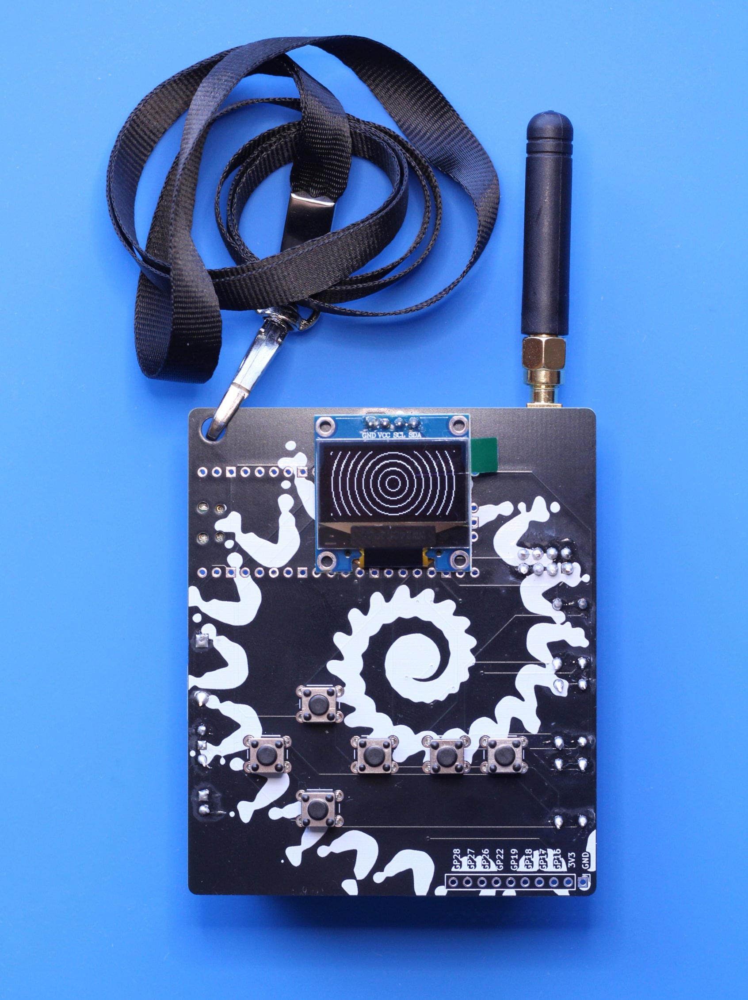

# INCBADGE 2024

  

This is a CC1101 based badge designed for DEFCON 32. It features several applications surrounding the ability to read, replay, and export digital signals in the ISM bands 300MHz-348MHz, 387MHz-464MHz, and 779MHZ-928MHz. It uses a Pi Pico as the MCU and has a battery pack with three AA batteries to ensure there's plenty of power to push the transmit abilites of the badge. 

## Featured Applications

The badge ships with quite a few applications by default, here are the highlights:

### RECORD+REPLAY

The badge is able to record signals with a number of adjustable parameters and the replay with the same or different parameters. Signals recorded from the badge can be dumped over serial by connecting the badge to a computer. 

### SCANNER

The SCANNER app runs through a number of preset frequencies that are commonly used by ISM devices and notes if there is any activity detected. This app is most useful for inspecting device that run on an unknown frequency. 

### FOXHUNT and FOX

Paired with a directional antenna (not included) the badge can be used for fox hunting, the act of finding hidden transmitters from their directional signal strength. The FOXHUNT app presents an RSSI graph of the selected frequency for use in this activity, and it is what I plan to use personally for the fox hunt at DEFCON 32. The FOX app can be use to periodically transmit signals for fox hunting practice. 

### IDLE

It's not really a badge if it doesn't have some neat visual flair for walking around, so the IDLE app provides a number of animations that play in sequence when running. This app is started by default when the badge is powered on. 

### And Others

The badge features more apps than the ones listed here, those will be further documented after the conference when I have more time. 

## Other Notes

This is the first conference badge I've designed and it's only my fourth PCB project, so I'm very proud of how it turned out! Here is some additional Q/A about the badge:

### When will hardware files be available?

I will upload hardware files after the conference when I get the project cleaned up a bit. As mentioned before, this was only my fourth PCB project, so you can probably imagine the project files are quite messy. It was designed in KiCad with the silkscreen graphics designed in GIMP.

### Will there be more firmware updates after the conference?

*Maybe*, at present I'm, a little burnt out on the project after it has consumed all my free-time for the past two weeks. I still have more ideas of applications I want to implement (namely duckyscript support, multiplayer games like pong, additional sub file support, and a POCSAG decoder) but I am out of time and a little out of brain power at this point, so we will see if/when I pick the project back up. 

### One of the applications crashed and showed me an error screen, what can I do about that?

I did my best to ensure that all applications work as expected at all times, but there will be occasional hiccups as most of the code in this project was written quite quickly. The application system on the badge features an ability for apps to close themselves with error codes, this is primarily used around interfacing with the CC1101 radio. If you encounter one of these error messages, feel free to submit a GitHub issue with any details you can around the crash.

###### This project is licesned under GNU GPLv3.